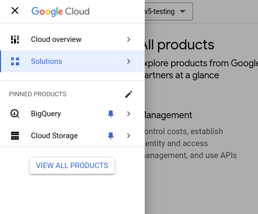
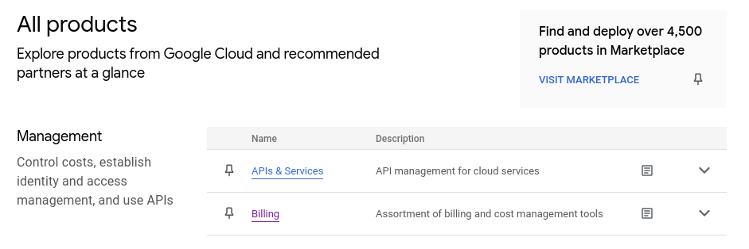

# Lab 9: Concurrency

Homework 5 involves calling external APIs, specifically the [Google Cloud Vision API](https://cloud.google.com/vision?hl=en). This specific API (and many others you will encounter) requires you to set up an account. In this lab, you will set up your environment to work with the Google Cloud API. Since this lab is about environment setup, you may work through any problems you encounter during setup with others, or seek help from the TAs during your lab session.

## Deliverables

- [ ] Sign up for an account and successfully make a call to the Google Cloud Vision API.
- [ ] Reimplement the Promise code in the repository as async/await.
- [ ] Identify a reason why async/await is preferred to Promises and explain it to the TA.

## Instructions

### Setting up a Google Cloud project

1. First, download and install the gcloud CLI interface using the instructions [here](https://cloud.google.com/sdk/docs/install). Once you reach the step where you are asked to run `gcloud init`, run it, then continue following the instructions below.
1. When asked for an account to use, do _not_ use your CMU email address. If you do, you will not be able to redeem the Google Cloud coupon that we provide you. Instead you should use your personal Gmail account, or sign up for a new one.
1. Create a new "project". This project is used by Google Cloud to organize your resources. This project will be used for both this lab and for Homework 5.
1. Log in with `gcloud auth login`. (If your current project is `[None]`, you may set your default project via `gcloud config set project PROJECT_ID`, where `PROJECT_ID` is the ID of the project you just created.)
1. Set the default application authentication with `gcloud auth application-default login`.

### Redeeming your Google Cloud Education Credit Coupon

1. Click on the Student Coupon Retrieval Link in the assignment posted to Canvas
1. Verify your _school_ email.
1. Click the redeem link in the email they send you.
1. In the window that is opened, in the upper-right of the screen **switch to the personal account** you used earlier. At this point you can enter the coupon code from the email. **Make sure that you do redeem the code for a personal Gmail account, not your Andrew account**, as it will not work for the latter and you might loose the coupon code in the process. If you receive an error that says "You may not have permission to create projects in this organization", double-check that you have switched to the proper account. _You are only able to redeem a code once; if you have difficulty please post privately on Piazza ASAP so that we can try obtain a new one_. If everything goes well, you will see a "Credit successfully applied" message.

### Enabling billing for your project

1. Open a web browser and [sign in to the Google Cloud console](https://console.cloud.google.com) with your personal account.
1. Select the project you just created in the box in the upper-left corner of the screen (here, the project I created is called "cmu17-214"):

3. Open the context menu to the left of the "Google Cloud" logo and click the "VIEW ALL PRODUCTS" button at the bottom.

4. Click the "Billing" link under "Management".

5. You will get a screen that says "This project has no billing account". On this page click "Link A Billing Account".

6. In the popup, select the new billing account "Billing Account for Education" from the dropdown and select "Set Account".

### Enabling the Cloud Vision API

Enable the Google Cloud Vision API by following [this link](https://console.cloud.google.com/flows/enableapi?apiid=vision.googleapis.com) and following the prompts. Make sure that you switch to your personal account, if necessary, in the Google Cloud console.

### Run and modify code

Clone the repository <https://github.com/CMU-17-214/f25-lab09> and follow the directions in the README.
